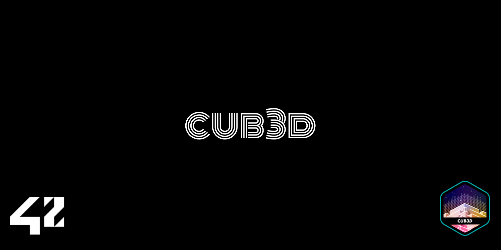

<!--# cub3d-->

Cub3D is a 3D raycasting game inspired by classic first-person shooters. The project involves building a game engine that renders a 3D environment based on a 2D map, simulating a first-person perspective. The engine handles textures, floor and ceiling rendering, and basic player movement.

## Project Overview

Cub3D aims to replicate a 3D environment using raycasting techniques. Players navigate through a map, viewing the world through walls, doors, and objects. The game engine also supports different textures for walls, floor, and ceiling.

---

## Features

### 1. **3D Raycasting**
   - Implements a 3D perspective using raycasting algorithms to simulate depth.
   - Renders walls, floors, and ceilings with textures.

### 2. **Player Movement**
   - Players can move forward, backward, and rotate.
   - Supports basic controls: `W` to move forward, `S` to move backward, and `A`/`D` to rotate left or right.

### 3. **Textured Walls**
   - Textures are applied to walls based on their orientation (north, south, east, west).
   - Supports sprite rendering for in-game objects.

### 4. **Floor and Ceiling Rendering**
   - The floor and ceiling are rendered with specified RGB colors.

### 5. **Map Parsing**
   - Maps are defined in `.cub` files with a specific format (resolution, textures, floor/ceiling colors, and walls).
   - Each map file can have unique textures and settings for the game.

### 6. **Game Loop**
   - The game runs in a loop, continuously updating the display based on player input and movement.
   - Implements basic event handling for window closing and keypresses.

---

## Requirements

- **macOS/Linux/Windows**: The project is compatible with all major operating systems.
- **Compilers**: The project uses `clang` (macOS) or `gcc` (Linux) for compilation.
- **Libraries**:
  - **MinilibX**: A graphical library used to render the game window.
  
  Ensure you have MinilibX installed and the appropriate libraries linked in your project.

---

## Compilation and Execution

### 1. **Clone the Repository**
   First, clone the repository using the following command:

   ```bash
   git clone https://github.com/luaraggio/Cub3d
   cd Cub3D
  ```
### 2. Compile the Project

Use the Makefile to compile the project:

```bash
make
```
### 3. Run the Game

After compilation, run the game with the following command:

```bash
./cub3d maps/example_map.cub
```
This will launch the game with the specified .cub map. Replace maps/example_map.cub with the path to any map you wish to use.
## Map Format

Maps in Cub3D are defined in .cub files. These files contain the following elements:

- **Resolution**: Defines the screen resolution.
- **Textures**: Paths to the textures for walls and optional sprites.
- **Colors**: Defines the RGB values for the floor and ceiling colors.
- **Map Layout**: Defines the layout of the map using a grid of 1 (wall) and 0 (free space).
### Example Map File (example_map.cub)

```txt
R 800 600        # Screen resolution (width x height)

NO ./textures/north.xpm   # Path to the north wall texture
SO ./textures/south.xpm   # Path to the south wall texture
EA ./textures/east.xpm    # Path to the east wall texture
WE ./textures/west.xpm    # Path to the west wall texture
S ./textures/sprite.xpm   # Path to the sprite texture (optional)

F 220,220,220          # Floor color (RGB)
C 0,0,0                # Ceiling color (RGB)

1 1 1 1 1 1 1 1 1 1  # Map layout (walls)
1 0 0 0 0 0 0 0 0 1  # '1' represents walls, '0' represents free spaces
1 0 1 1 1 1 1 0 0 1  # The player cannot walk through walls
1 0 0 0 0 1 1 0 0 1  # The player can move through free spaces
1 1 1 1 1 1 1 1 1 1  # Walls must surround the map
```
## Controls

- **W**: Move forward.
- **S**: Move backward.
- **A**: Rotate left.
- **D**: Rotate right.
- **Esc**: Quit the game.

## Makefile

The Makefile includes several useful targets for managing the project.

### Targets:

- **all**: Builds the project.
- **clean**: Removes object files (.o files).
- **fclean**: Removes object files and the executable (cub3d).
- **re**: Rebuilds the project from scratch.
- **valgrind**: Runs the project with Valgrind to check for memory leaks.
- **norm**: Runs the Norminette to check for code style compliance.
 
### Usage:

``` bash
make        # Builds the project
make clean  # Removes object files
make fclean # Removes object files and executable
make re     # Rebuilds the project from scratch
make valgrind  # Runs Valgrind to check for memory leaks
make norm    # Runs Norminette checks
```
## Conclusion

Cub3D is a fun and educational project that provides a simple 3D raycasting engine. It gives you the opportunity to dive into computer graphics, map parsing, and handling user input in a game environment. By working with the project, you'll gain valuable experience in programming with C, particularly in graphics rendering, memory management, and system-level programming.

This project also challenges you to handle complex algorithms, such as raycasting, which is the foundation of many early 3D games. Overall, Cub3D offers both a solid technical foundation and an exciting experience in game development.
